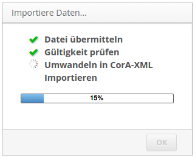

Projects act like a folder or container for documents.  Before you can import a
document, you need to create at least one project.  User access rights, default
tagsets used by contained documents, etc. are all configured on a per-project
level.

- - -

To manage projects, change to the tab "Administration" while logged in to
CorA with an administrator account.

+ **Create a new project** by clicking the "Add Project" button at the top of
  the page.  You will be prompted for a name for the project, and can edit
  individual settings afterwards.

You can manage existing projects in the "Project Management" section of the
admin page.  Individual settings can be changed by clicking on "Edit
settings...", namely:

+ **Script for editing tokens**: The command to be run whenever
  [a token is edited](edittoken.md);
  see [below for details](#setting-a-token-editing-script).

+ **Script for importing new texts**: The command used for importing new
  documents in a project-specific file format;
  [see below for details](#setting-an-import-script).

+ **User associations**: Select all users that should have access to this
  project.  There is currently no fine-grained rights management &mdash; anyone
  with access to a project has read/write access to all files contained within.

+ **Default tagset associations**: Select all tagsets to be linked to new
  imported texts in this project.  Note that this affects only *new* imported
  texts; to change tagset associations for existing texts, find the text in the
  "File" tab, then click on "Tagsets..." to view and/or change all associated
  tagsets.

**IMPORTANT:** When associating texts with tagsets, make absolutely sure that
  your selection includes 1) a *maximum of one* tagset for each type; and 2)
  *exactly one* tagset of type 'pos'.  *(The second restriction exists for
  historical reasons, and might be dropped someday.)* The system currently does
  not prevent you from creating associations that violate these criteria, but
  CorA will not work properly otherwise.  To learn more about tagsets and what
  the different types mean, refer to
  [the section on annotation layers](layers.md).

## Setting a token editing script

CorA offers the feature to [edit the document itself](edittoken.md) if the need
arises.  In order to use this feature, a script that handles the editing must be
set in the project settings.

Why is a script needed for this?  It's because of CorA's internal
[document model](document-model.md) that distinguishes between tokens, "dipls",
and "mods": when you edit a token, the subordinated "dipl" and "mod" elements
need to be updated as well.  In order to generate these child elements, and
because this process is highly project-specific, CorA calls an external script
for this task.

A token editing script must:

1. Be executable for the web server process.
2. Read input from a file given as a positional argument.
3. Return either an error message (e.g. if the input is considered to be
   invalid), or a valid JSON object in the following format:

```json
{"dipl_trans": ["foo=", "b{ae}r"],
 "dipl_utf": ["foo=", "bær"],
 "dipl_breaks": [1, 0],
 "mod_trans": ["foo=b{ae}r"],
 "mod_ascii": ["foobar"],
 "mod_utf": ["foobær"]}
```

In the returned object, `dipl_utf`, `dipl_trans`, `mod_trans`, `mod_ascii`, and
`mod_utf` contain the values of the respective fields in the
[document model](document-model.md).  Since there can be multiple dipl/mod
elements for one token, values are always returned in an array.  All `dipl_*`
arrays must have the same length; the same applies to all `mod_*` arrays.

The `dipl_breaks` array specifies if
[line breaks in the original document](document-model.md#layout) occur after any
of the dipl elements.  A value of 1 in this array means that a line breaks
occurs after the dipl element in this position, while a value of 0 indicates no
line break.

In the example above, the JSON object specifies that there is one modern token
(or "mod" element) with the trans/ascii/utf values of
"foo=b{ae}r"/"foobar"/"foobær" respectively, but in the original document there
have been two separate tokens (or "dipl" elements) "foo=" and "bær".  Moreover,
there should be a line break in the original document after the first diplomatic
token "foo=".

If you want **a simple solution** without any of the complexity of the document
model (or if you want an example script to look at), you can use the script
`bin/cora_edit_singletoken.py` from the repository.  This script simply returns
the input unchanged for all values of the JSON object.

## Setting an import script

Importing documents into CorA is done via the [CorA-XML format](coraxml.md).
Before it can be imported, a document always needs to be converted to CorA-XML
first.  If you have a script that converts whatever file format you start with
into CorA-XML, you can embed it into CorA, so anyone can now import documents in
your own file format.  This is purely for convenience, so users don't need to
perform the conversion themselves, but can instead rely on CorA and the supplied
import script to do this automatically.

An import script must:

1. Be executable for the web server process.
2. Accept two filenames as arguments: an input file, and an output file.
3. Convert the input file to valid [CorA-XML](coraxml.md) and write it to the
   given output file.
4. Print status updates to the standard output (see below).

While an import script is running, the user sees a progress dialog similar to
this one:



The contents of this window are **determined by the output of the import
script.** Of the output that is written to STDOUT, CorA recognizes certain lines
as status indicators:

+ `~BEGIN CHECK` or `~BEGIN XML` indicate that the checking of the input file's
  validity or the actual XML conversion have begun, respectively.  In the GUI,
  this is indicated by a spinning circle.
+ `~SUCCESS CHECK` or `~SUCCESS XML` indicate that the respective action has
  succeeded, and will cause the GUI to display a green checkmark.
+ `~ERROR CHECK` or `~ERROR XML` indicate that there was an error with the
  respective action.  All lines which are *not* recognized as status messages
  will be displayed to the user as an error message, and the import will be
  aborted.
+ `~PROGRESS <num>` sets the value of the progress bar, where `<num>` can be a
  floating point number between zero and one (e.g., "0.52" represents a progress
  of 52%).

For **a simple solution**, you can take a look at the
`bin/cora_import_one_token_per_line.sh` script in the repository, which accepts
a text file with one token per line and converts it into a simple CorA-XML
document.  *(This doesn't use any of the advanced features, such as layout
information, of the [CorA document model](document-model.md), though.)*
