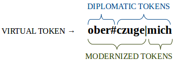

Understanding CorA's document model --- i.e., the logical representation of
documents within the software --- can be helpful for understanding certain
aspects of the tool better, and is crucially important when trying to import
your own texts into CorA.  The [CorA-XML file format](coraxml.md) closely
reflects this model.

The main design goal for this document model was to be suitable for historical
documents and other non-standard data.  It tries to address the problem
of [tokenization](#tokenization) by distinguishing between the appearance
in the original document and the desired units of annotation.  Furthermore, it
keeps information about the original [document layout](#layout).

## Tokenization

"Token" in a general sense is the name of a unit, usually roughly corresponding
to a "word", that is processed by an NLP tool.  When working with non-standard
data in particular, it is not always easy to define what a "token" should be.
Furthermore, the units that should be annotated might not be what is actually
found in the text (e.g., when separating by whitespace), for a variety of
reasons.

In CorA, **virtual tokens** exist purely as a container for two different types
of tokenization:

+ **Diplomatic tokens** (sometimes called "dipl"s), which correspond to tokens
  as they appear in the source document.  [Layout information](#layout), which
  also relates to the document's appearance, refers to this type of tokens.
  They are not relevant for the annotation and therefore currently not shown in
  the web interface.

+ **Modernized tokens** (sometimes called "mod"s), which are the units of
  annotation.  They are displayed in the editor (each row in the editor
  corresponds to one modernized token) and only they can actually carry
  annotations.

The "virtual token" unit now acts as the **smallest overarching span** for any
set of diplomatic and modernized tokens.  This way, it connects the two
tokenization layers and allows inference about the relationship between
diplomatic and modernized tokens.

!!! note "Note"
    It's important to note that the difference between "diplomatic"
    and "modernized" tokens is purely one of **tokenization.**  To put it
    another way, diplomatic and modernized tokens simply provide two different
    *partitions* of the underlying virtual tokens.  The following examples might
    make this clearer.

    In particular, "modernized" in this sense does *not* mean that the form of
    the token (e.g. spelling) has been modified in any way.
    A modernization or standardization of spelling would usually be
    considered to be a form of [annotation layer](layers.md#normalization)
    in this model, not a property of the token itself.

### Some examples

In the simplest case, virtual/diplomatic/modernized tokens are all identical.
It's not unusual if this is the case for the vast majority of tokens in your
document:

<table class="tokenization">
    <thead>
    <tr class="token-tok">
        <th class="label">virtual token</th><th class="tok">das</th>
    </tr>
    </thead>
    <tbody>
    <tr class="token-dipl">
        <td class="label">diplomatic</td><td class="tok">das</td>
    </tr>
    <tr class="token-mod">
        <td class="label">modernized</td><td class="tok">das</td>
    </tr>
    </tbody>
</table>

For a more interesting example, let's take the example wordform "soltu", a
common word in historical German texts.  It can be analyzed as a contraction of
a verb and a pronoun, namely the modern German "sollst du" (lit. *"should
you"*).  Therefore, we decide to annotate these wordforms as two separate
tokens, "solt" and "u".[^1] However, we want to keep the information that, in
the source manuscript, "soltu" is a single word.  We could represent this in our
document model in the following way:

<table class="tokenization">
    <thead>
    <tr class="token-tok">
        <th class="label">virtual token</th><th class="tok" colspan="2">soltu</th>
    </tr>
    </thead>
    <tbody>
    <tr class="token-dipl">
        <td class="label">diplomatic</td><td class="tok" colspan="2">soltu</td>
    </tr>
    <tr class="token-mod">
        <td class="label">modernized</td><td class="tok">solt</td><td class="tok">u</td>
    </tr>
    </tbody>
</table>

More complex cases are possible.  Let's take the (again, German) example "ober
czugemich", which would correspond to modern German "überzeuge mich"
(lit. *"convince me"*).  For some reason, the verb ("ober czuge") is separated
in the manuscript, but the pronoun ("mich") is attached to the verb.  This could
be due to mistakes by the manuscript writer, or simply lack of space, but in any
case we'd like to preserve that information, but still base our annotation on a
more semantically appropriate tokenization of this sequence.  In our document
model, this would look like:

<table class="tokenization">
    <thead>
    <tr class="token-tok">
        <th class="label">virtual token</th><th class="tok" colspan="3">ober czugemich</th>
    </tr>
    </thead>
    <tbody>
    <tr class="token-dipl">
        <td class="label">diplomatic</td><td class="tok">ober</td><td class="tok" colspan="2">czugemich</td>
    </tr>
    <tr class="token-mod">
        <td class="label">modernized</td><td class="tok" colspan="2">oberczuge</td><td class="tok">mich</td>
    </tr>
    <tr style="visibility: hidden;">
        <td class="label"></td><td class="tok"></td><td class="tok"></td><td class="tok"></td>
    </tr>
    </tbody>
</table>

Here, the relationship between the modernized "oberczuge" and the diplomatic
tokens (i.e., that it consists of the first diplomatic token and parts of the
second) is not expressed directly, but only indirectly via their common "virtual
token" span that contains them.  As mentioned before, you can view diplomatic
and modernized tokens as (potentially) different subdivisions of the virtual
token unit:

{: .figure .align-center}

### Token representations

Apart from the different tokenization layers described above, there are
different *representations* of any given token as well.

+ **trans:** Originally for "transcription", this is the underlying base
  representation of a token.  It is one of the forms that can be displayed in
  the editor, and it is important as the basis for token editing (see below).

+ **utf:** Purely for viewing purposes, and one of the forms that can be
  displayed in the editor.  This field can be used for a proper Unicode
  representation of a token in case the 'trans' form encodes special
  characters in some way.

+ **ascii:** Only for modernized tokens, this field is the opposite of 'utf' in
  that it is intended to be a simple, ASCII representation of the token.  It is
  used as input for external annotation tools.

For example, if the transcription encodes the
["long s" character](http://www.fileformat.info/info/unicode/char/17f/index.htm)
'ſ' as '$' (e.g., for easier typing by the transcribers), a modernized token
could have the following representations:

<table class="tokenization">
    <thead>
        <tr>
            <th class="label">trans</th><th class="label">utf</th><th class="label">ascii</th>
        </tr>
    </thead>
    <tbody>
        <tr>
            <td class="tok">$prach</td><td class="tok">ſprach</td><td class="tok">sprach</td>
        </tr>
    </tbody>
</table>

When [editing tokens](doc-edit.md), it is always the 'trans' form of the virtual
token that is edited, and the other representations must be *derivable* from
that.  Examples for that include special character encodings (like the "long s"
in the example above) or split marks for diplomatic/modernized tokens.  For
example, to represent the [complex "oberczuge mich" example
from above](#oberczugemich), the 'trans' form
could include special characters to mark the token boundaries:

<table class="tokenization">
    <thead>
        <tr>
            <th></th><th class="label">trans</th><th class="label">utf</th><th class="label">ascii</th>
        </tr>
    </thead>
    <tbody>
        <tr>
            <td class="label">virtual token</td><td class="tok">ober#czuge|mich</td><td class="tok"></td><td class="tok"></td>
        </tr>
        <tr>
            <td class="label" rowspan="2">diplomatic tokens</td><td class="tok">ober#</td><td class="tok">ober</td><td class="tok"></td>
        </tr>
        <tr>
            <td class="tok">czuge|mich</td><td class="tok">czugemich</td><td class="tok"></td>
        </tr>
        <tr>
            <td class="label" rowspan="2">modernized tokens</td><td class="tok">ober#czuge|</td><td class="tok">oberczuge</td><td class="tok">oberczuge</td>
        </tr>
        <tr>
            <td class="tok">mich</td><td class="tok">mich</td><td class="tok">mich</td>
        </tr>
    </tbody>
</table>

Note again that the 'trans' forms of the virtual/diplomatic/modernized tokens
only differ in tokenization, and still include the special characters ('#' to
mark diplomatic token boundaries, '|' to mark modernized token boundaries, but
you are free to use different conventions), while the other representations can
be anything you want, as long as they're derivable from 'trans'.

Here is an overview of which representations are supported by the tokenization
layers:

<table class="tokenization">
    <thead>
        <tr>
            <th></th><th class="label">trans</th><th class="label">utf</th><th class="label">ascii</th>
        </tr>
    </thead>
    <tbody>
        <tr>
            <td class="label">virtual token</td><td>&#x2713;</td><td>&mdash;</td><td>&mdash;</td>
        </tr>
        <tr>
            <td class="label">diplomatic</td><td>&#x2713;</td><td>&#x2713;</td><td>&mdash;</td>
        </tr>
        <tr>
            <td class="label">modernized</td><td>&#x2713;</td><td>&#x2713;</td><td>&#x2713;</td>
        </tr>
    </tbody>
</table>

## Layout

Layout information is intended as a way to preserve information about the
original structure of a document.  This data is mainly just stored internally
and shown in the ["Line"
column of the editor table](doc-annotate.md#the-editor-table), but
cannot be modified in any way within the web interface.

[Diplomatic tokens](#tokenization) form the basis for layout information, since
they represent the tokenization as found in the source document.  There are
three levels of layout elements:

+ **Pages** are at the highest level of layout elements; they can be named with
  up to 16 characters, so you aren't restricted to numbers, and can optionally
  have a (one-character) "side" identifier (e.g., *r*ecto and *v*erso is
  commonly used with historical documents).

+ **Columns** can subdivide pages and have a one-character name.

+ **Lines** can subdivide columns and have a name of up to five characters; they
  are the lowest level of layout elements and point to individual diplomatic
  tokens.

Each document layout is made up of one or more *pages*; each page contains one
or more *columns*; each column contains one or more *lines*; and each line
contains one or more diplomatic tokens.  The dependency chain thus looks like
this:

*page* &#x2192; *column* &#x2192; *line* &#x2192; *diplomatic token*
{: .figure .align-center}

If you don't want or need all of these elements, that is fine, but you still
need to include at least one of each type.  For example, if you don't need
the 'column' element (since all of your pages have only a single column), you
still need to have a "dummy" column element for each page in your document;
you *cannot* have pages refer to lines directly.

Likewise, if you don't want to use layout information at all, it's fine to
create exactly one "dummy" element of each type and link all diplomatic tokens
to the same 'line', but you cannot omit these elements altogether.

## Further components

The following section contains features of the document model that are currently
supported, but not integrated into the web interface at this time.  Unless
stated otherwise, they are supported during import/export (and kept in the
database), but have no functional significance.  They exist mainly for
historical reasons, and might be integrated in the user interface at some point,
but until then, you should probably try to avoid using them.

### Shift tags

Shift tags act as a mark-up for a span of tokens.  They can be used to
mark a certain range of tokens to be "foreign material" (e.g., Latin passages in
an otherwise English text) or to have "rubricized letters".

### Token-level comments

Besides the ['comments' annotation
layers](layers.md#comments-secondary-comments), there is
support for comments on the token-level (i.e., the [virtual
token](#tokenization) of this document model).  They can be given a
one-letter "type" abbreviation that has no functional significance.

[^1]: Of course, this is not the only way such cases can be handled.  We do not
claim that tokenizing the example in this fashion is the only, or even
the "best" way to do things --- the examples mainly serve to illustrate how
things would be represented in CorA *if* we want to analyze the data in the
described way.
