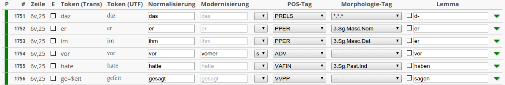

This section gives a brief introduction to the basic concepts and functionality
of CorA.

## What is CorA?

CorA (short for *Corpus Annotator*) is a web-based annotation tool, intended for
token-level annotation of non-standard language data.  Let's break this down:

+ CorA is **web-based.** This means that users only need a web browser and an
  active internet connection to work with it, which has the advantage that
  users can work from any computer with access to the internet, without having
  to install any additional software.  On the other hand, this means that you
  first need to have a web server where CorA can run.  For details about the
  requirements and the installation process, see
  [the section on installing CorA](setup-install.md).

+ CorA is **a token-level annotation tool.** That means it is intended for
  linguistic annotation of texts, such as [assigning part-of-speech tags to
  words](https://en.wikipedia.org/wiki/Part-of-speech_tagging).  Various [types
  of annotations](layers.md#list-of-annotation-layers) are supported.
  The software is particularly designed for annotations on a token level,
  i.e. annotations with a one-to-one correspondence to tokens.  Structural
  annotations, such as building syntax trees or labeling spans of text, are not
  supported and would be quite cumbersome to do in CorA.

+ CorA is **designed with non-standard language data in mind.** We use the
  term "non-standard" broadly to refer to anything that isn't modern,
  standardized language (think of newspaper articles), such as: historical
  documents, computer-mediated communication (Twitter, Facebook, chat
  rooms, ...), texts produced by language learners, etc.  Various features of
  the tool have been designed for the particular needs of working with this
  type of data, such as:

    * Distinguishing between [different levels of
      tokenization](document-model.md#tokenization) to
      account for differences regarding word boundaries

    * Keeping [layout information](document-model.md#layout), e.g. to preserve
      the structure of a historical document

    * The ability to [edit, add, or delete tokens](doc-edit.md) in the source
      document directly within the software

    * [Calling external annotation tools](doc-taggers.md) directly from CorA,
      and optionally being able to
      [retrain them](doc-taggers.md#retraining-an-annotator) progressively in
      order to improve results

## How do I use CorA?

If you are a server administrator, you should look at the instructions for
[installing](setup-install.md) and [configuring](setup-config.md) CorA on your
web server.

If you are a regular user wanting to annotate in CorA, just point your web
browser to the URL where your individual CorA instance is running.  Your server
administrator should tell you this URL, since it depends on where they installed
the software --- there is no "public" server available that you can use.

Once logged in to CorA, you can click on any of the available documents to open
it in the editor.  Documents are
[displayed in a table](doc-annotate.md#the-editor-table) with one token per
line, and columns for the different layers of annotation (such as POS or
lemma), which could look like this:

{: .figure .align-center}

Sample screenshot of the editor table
{: .figure-caption .align-center}

Apart from annotating the text, you can also [search in the currently opened
document](doc-search.md), [edit a token itself](doc-edit.md), or [call
external annotation tools](doc-taggers.md) if your administrator
has configured any.

Two important things to keep in mind:

+ Only **one user at a time** can work on any given document.  While you've
  opened a document, nobody else can open the same document until you close it
  again or log out of CorA.

+ CorA requires an **active internet connection.** It's not a problem if you get
  disconnected from the internet briefly (say, a few minutes), but since CorA
  frequently communicates with the server, longer disconnects will cause
  problems or render the tool unusable.

## How do I get my data into CorA?

This section assumes that you're an administrator, you have just installed a
fresh copy of CorA on your server, and now you want to know what's required to
get your own texts into the software.

All documents are organized in **projects**, so the first thing you need to do
is [create a new project](admin-projects.md) for your texts.  If you're an
admin, you can always access all texts and projects, but if you want regular
users to work with your project, you need to [create **user
accounts**](admin-users.md) for them and *associate them with your project(s)*
in the project settings.

When you've done this, you need to decide which [**annotation
layers**](layers.md) to use with your texts.  CorA
supports various annotation layers such as POS tags, lemmatization,
normalization, and others, but you don't need to use all of them at the same
time --- you can configure which annotation layers will be used on a
per-document or a per-project level.  If you're using a ["closed" annotation
layer](layers.md#open-vs-closed-layers) (such as POS) that
requires a tagset, you need to [import the tagset](admin-tagsets.md) before you
can use it.

To **import your own document** into CorA, you'll need to convert it
to [CorA-XML format](coraxml.md) first.  This is likely to be the most
time-consuming step, since it requires understanding the internal [**document
model**](document-model.md) first.

Basically, a document consists of a set
of tokens which can [distinguish different tokenization
layers](document-model.md#tokenization) (i.e., tokenization in the source
document vs. tokenization for annotation purposes) and [different string
representations](document-model.md#token-representation) (e.g., a Unicode
representation vs. a simplified ASCII string).  Furthermore, each text is
required to have [layout information](document-model.md#layout) (i.e., which
tokens belong to which pages/columns/lines in the source document).  You don't
need to actually use all of these features --- a simple script that converts
text files with one token per line to CorA-XML is already [part of the
repository](admin-projects.md#import-simple) --- but they still need to be
represented in the XML.

Some features may require a deeper understanding of these internals if you want
to configure them for your project, such as [enabling the editing of
tokens](admin-projects.md#setting-a-token-editing-script) or [embedding an
external annotation tool](admin-taggers.md), but this burden is mainly on the
administrator, and not the regular user.  Quite to the contrary,
if you write a script that converts your documents to CorA-XML, you can even
[embed it into CorA](admin-projects.md#setting-an-import-script) to enable your
users to conveniently import texts without having to worry about the conversion
themselves.

*[POS]: part-of-speech
