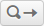
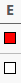

When you've [opened a document](doc-manage.md) in CorA, you can switch to the
tab "Edit", where you can view the document contents and make annotations.  The
tab consists of a [**toolbar**](#the-toolbar), the
[**editor table**](#the-editor-table), and (optionally) a
[**text preview**](#horizontal-text-preview).

## The toolbar

The toolbar at the top of the page allows you to navigate the document and
perform various actions.

Button     | Function
---------- | -------------------------------------------------------------------
{: .min-125} | Your current position in the document.  Values shown here depend on your [editor settings](doc-customize.md).  Click on this element to **navigate** to a page by number.
 | Go to the **previous page**.
 | Go to the **next page**.
Jump to Line | Go to a **specific line number** (the bold number at the beginning of a row).
 | **Undo** an annotation.  All changes made in the editor table can be undone, *except for* [automatically generated annotations](doc-taggers.md) and [editing tokens](doc-edit.md).
 | **Redo** an annotation.  ("Undo the undo.")
Search | Start a [**search**](doc-search.md) within the document.
 | Jump to the **previous [search result](doc-search.md)**.
 | Jump to the **next [search result](doc-search.md)**.
Annotate automatically | Run an [**external annotation tool**](doc-taggers.md) on the document.
Metadata | View/change the document's **metadata**, i.e. custom ID, name, and header.

## The editor table

The heart of the editor is the editor table, which looks similar to this:

{: .figure .align-center}

Sample screenshot of the editor table
{: .figure-caption .align-center}

Each line in the editor table corresponds to one *modernized token* in the
[document model](document-model.md).  The exact configuration of columns that
you see depends on the [annotation layers](layers.md) that are linked to the
document and your [editor settings](doc-customize.md).  Here is a description of
the columns that will *always* be present (if you haven't hidden them):

+ 
  {: .float-right .extra-margin}

    **Progress bar (P):** This is a visual indicator of the annotation progress in
    the current document.  Whenever you change an annotation, the progress bar
    updates to cover the document up to this point.  You can also toggle the
    progress up to a certain point by **clicking on the bar.**

    Functionally, the status of the progress bar only matters when
    [calling an automatic annotator](doc-taggers.md).

+ 
  {: .float-right .extra-margin}

    **Token number (#):** A sequential numbering of all tokens in the document.
    Can be used to refer to a specific token, roughly estimate its position
    within in the document, or directly jump to it by using "Jump to Line" from
    the toolbar.

+ **Line:** A condensed representation of the token's position in the
    [original document layout](document-model.md#layout).

+ 
  {: .float-right .extra-margin}

    **Mark (E):** A checkbox that can be used to **mark/highlight tokens**,
    intended for marking problematic/erroneous cases that you might want to
    review later, but can actually be used in any way you want.  There is no
    special functionality attached to this field except that you can
    [easily search for it](doc-search.md).

+ **Token (Trans/UTF):** The "trans" and "utf"
  [representations of the token](document-model.md), respectively.  You probably
  want to hide one of the two in the [editor settings](doc-customize.md).

+ **Dropdown menu** () at the end of
  the row: Can be used to call the [token editing features](doc-edit.md) or to
  quickly [search](doc-search.md) for similar tokens.

Other columns are specific to certain annotation layers; please refer to the
[list of annotation layers](layers.md#list-of-annotation-layers) for more
information.

### Saving changes

There is no "save" button in CorA.  Changes you make in the editor are **saved
automatically.**

As long as the connectivity icon
() in the top right corner of the
screen is **green**, there is a connection to the server.  A **red** icon
indicates a problem --- although if it turns green again within a few minutes,
this is nothing to worry about, since trivial problems such as a temporary loss
of your wi-fi connection could trigger this as well.  Should you have unsaved
changes for more than 3--4 minutes due to connectivity problems, CorA
will **alert you with a pop-up notification**, so you won't suddenly lose
several hours' worth of work.

!!! note "Note"
    If you want to exit CorA, and want to be certain that **all of
    your changes have been saved,** it is best to close the document
    explicitly by clicking on the "Close file" button at the top right.  If
    the document closes normally and you return to the file overview again, you
    can be certain that all of your changes were saved.

If you want to discard any recent changes that you've made, you can always use
the **undo button** ({: .inline}) in
the toolbar.

## Horizontal text preview

At the bottom of the page, you will find a text preview field that shows an
excerpt from the currently opened document.  Contrary to the editor table, which
shows one token per line, the text preview shows the text consecutively (or
"horizontally").  This allows you to easily read the passage that you're
currently annotating.

While navigating within the editor table, the token corresponding to the row
you're currently in is **highlighted** in the text preview.  Furthermore, the
preview shows **up to 30 tokens before and after** the current page in the
editor.  This allows you to, for example, set the number of displayed lines per
page low enough so you don't need to scroll, but still see enough textual
context to make informed decisions during annotation.

You can [customize](doc-customize.md) which token representation is shown in the
text preview, or turn it off completely.
